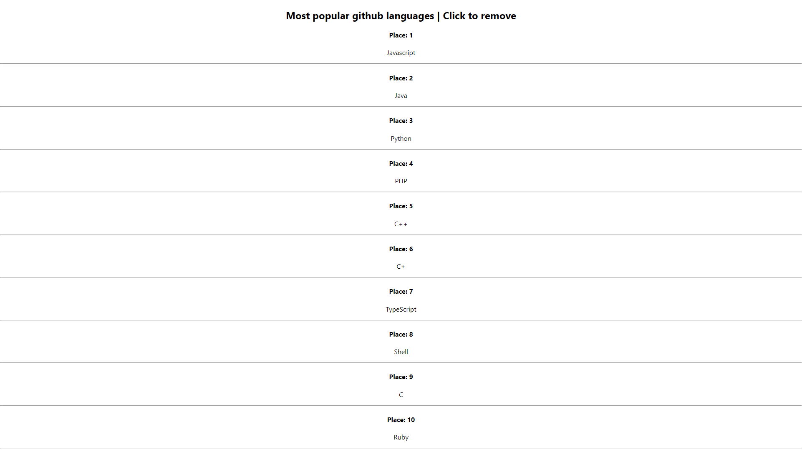
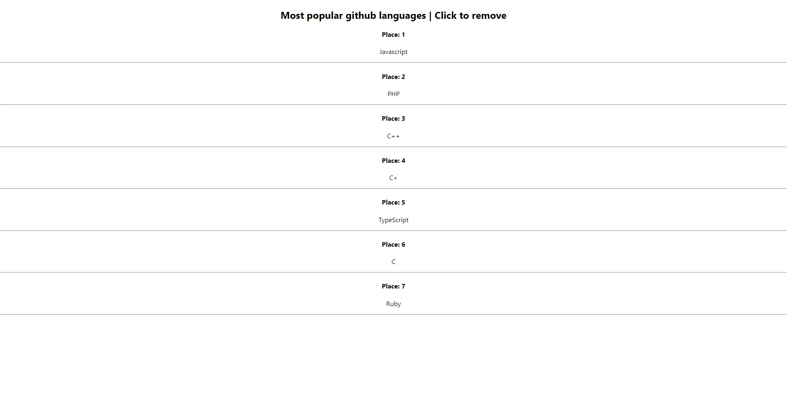

# Based on the other advanced rendering assignment
Users can now also click to delete a language from the list. Data does not persist, the list will reset upon refreshing.
Update: fixed assignment so that key warning goes away

